# E-Commerce Shopping App

A feature-rich mobile e-commerce application built with Flutter that demonstrates modern state management using Cubit, REST API integration, and local data persistence.

---

## Overview

This fully functional e-commerce mobile application enables users to browse products, search and filter items, manage a shopping cart, and customize their experience with dark mode. The app fetches product data from the FakeStore API and implements offline functionality through local data caching.

---

## Features

### Product Management
- **Product Listing** - Display all products in scrollable grid or list view layouts
- **Product Details** - View comprehensive information including title, price, description, rating, and category
- **View Toggle** - Seamlessly switch between grid and list view presentations
- **Pull-to-Refresh** - Refresh product catalog with a simple pull-down gesture

### Search and Filtering
- **Real-time Search** - Instantly search products by title or description as you type
- **Category Filtering** - Filter products by category (Electronics, Jewelry, Men's Clothing, Women's Clothing)
- **Multiple Sort Options**:
  - Sort by price (low to high)
  - Sort by price (high to low)
  - Sort by rating (highest first)
  - Sort by name (A-Z)
- **Combined Filtering** - Apply search, category filter, and sort simultaneously for precise results

### Shopping Cart
- **Add to Cart** - Add products with customizable quantity selection
- **Cart Management**: 
  - Update item quantities with intuitive +/- buttons
  - Remove individual items from cart
  - View subtotal for each item
  - View total cart value
- **Cart Persistence** - Cart data is saved locally and persists across app restarts
- **Cart Badge** - Real-time item count displayed on cart icon
- **Empty Cart State** - User-friendly message when cart is empty

### User Experience
- **Dark Mode** - Toggle between light and dark themes with smooth transitions
- **Theme Persistence** - Dark mode preference is saved and automatically restored
- **Offline Mode** - Browse previously cached products without an internet connection
- **Loading States** - Clear loading indicators during data fetch operations
- **Error Handling** - User-friendly error messages with retry options
- **Success Notifications** - Instant feedback when adding or removing items from cart
- **Empty States** - Helpful messages when no products are found

---

## Technology Stack

### Framework and Language
- **Flutter** - 3.16.0+ (UI framework)
- **Dart** - 3.0.0+ (Programming language)

### State Management
- **flutter_bloc** - ^8.1.3 (Cubit/Bloc pattern implementation)

### Networking
- **http** - ^1.1.0 (HTTP client for API requests)

### Local Storage
- **shared_preferences** - ^2.2.2 (Persistent key-value storage)

### UI Enhancement
- **cached_network_image** - ^3.3.0 (Image caching and loading)

### Utilities
- **equatable** - ^2.0.5 (Value equality for state comparison)

### Dependencies
```yaml
dependencies:
  flutter:
    sdk: flutter
  flutter_bloc: ^8.1.3      
  http: ^1.1.0              
  shared_preferences: ^2.2.2 
  cached_network_image: ^3.3.0 
  equatable: ^2.0.5         
```

---

## API Integration

This application uses the **FakeStore API** - a free REST API for testing e-commerce applications.

**Base URL**: `https://fakestoreapi.com`

**Endpoints Used**:
- `GET /products` - Fetch all products
- `GET /products/{id}` - Fetch single product details
- `GET /products/categories` - Fetch all categories

---

## Project Structure

```
ecommerce_app/
├── assets
│   ├── screenshots/
├── lib/
│   ├── main.dart                             
│   ├── models/                                
│   │   ├── product.dart                       
│   │   └── cart_item.dart                     
│   ├── services/                              
│   │   └── api_service.dart                   
│   ├── cubits/                                
│   │   ├── product/                           
│   │   │   ├── product_state.dart             
│   │   │   └── product_cubit.dart             
│   │   ├── cart/                              
│   │   │   ├── cart_state.dart                
│   │   │   └── cart_cubit.dart                
│   │   ├── theme/                             
│   │   │   └── theme_cubit.dart              
│   │   └── view_mode/                         
│   │       └── view_mode_cubit.dart           
│   ├── screens/                              
│   │   ├── home_screen.dart                   
│   │   ├── product_detail_screen.dart         
│   │   ├── cart_screen.dart                   
│   │   └── settings_screen.dart               
│   └── widgets/                               
│       ├── product_card.dart                  
│       └── cart_item_widget.dart                                                
├── android/                                       
├── test/                                      
├── pubspec.yaml                               
└── README.md                                 
```

---

## Getting Started

### Prerequisites

Before running this project, ensure you have:

- **Flutter SDK** - Version 3.16.0 or higher
- **Dart SDK** - Version 3.0.0 or higher
- **IDE** - VS Code or Android Studio with Flutter plugins
- **Device** - Android emulator, iOS simulator, or physical device
- **Internet Connection** - Required for initial launch to fetch products

### Verify Flutter Installation

```bash
flutter --version
flutter doctor
```

Ensure `flutter doctor` shows no critical errors before proceeding.

### Installation

#### 1. Clone the Repository

```bash
git clone <repository-url>
cd ecommerce_app
```

#### 2. Install Dependencies

```bash
flutter pub get
```

This command downloads all required packages listed in `pubspec.yaml`.

#### 3. Configure Android Permissions

The app requires internet permission to fetch products. Edit `android/app/src/main/AndroidManifest.xml` and add the following inside the `<manifest>` tag:

```xml
<manifest xmlns:android="http://schemas.android.com/apk/res/android">
    
    <!-- Add these permissions -->
    <uses-permission android:name="android.permission.INTERNET" />
    <uses-permission android:name="android.permission.ACCESS_NETWORK_STATE" />
    
    <application
        ...
    </application>
</manifest>
```

#### 4. Set Up a Device

**Option A: Android Emulator**
```bash
# List available devices
flutter devices

# Create an emulator via Android Studio
# Android Studio > Tools > Device Manager > Create Device
```

**Option B: Physical Device**
- **Android** - Enable USB debugging in Developer Options
- **iOS** - Connect to Mac and trust the computer

#### 5. Run the Application

```bash
# Run on connected device
flutter run

# Run on specific device
flutter run -d <device-id>

# Run in release mode (optimized performance)
flutter run --release
```

The first launch may take 2-5 minutes to build.

### Troubleshooting

**Issue: "No devices found"**
```bash
flutter devices  # Check connected devices
```

**Issue: Products not loading**
- Verify internet connection
- Check internet permission in `AndroidManifest.xml`
- Use the retry button in the app

**Issue: Build errors**
```bash
flutter clean
flutter pub get
flutter run
```

**Issue: Hot reload not working**
- Press `r` in terminal for hot reload
- Press `R` for full restart
- Save files before attempting hot reload

---

## Screenshots

### Home Screen

<div align="center">

**Grid View**

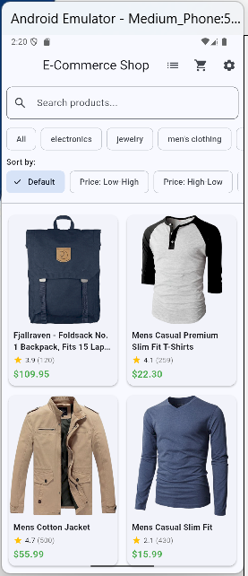

*Product listing in grid layout with search bar and category filters*

**List View**

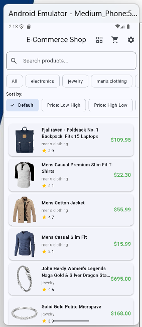

*Product listing in list layout showing detailed information*

</div>

### Search and Filtering

<div align="center">

**Search Functionality**

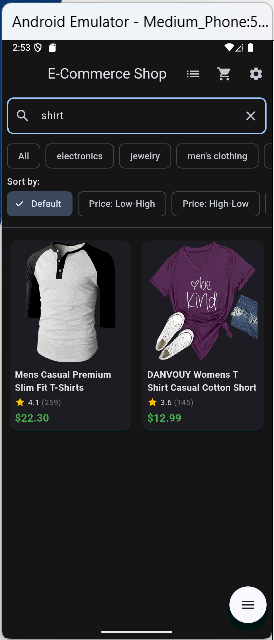

*Real-time search filtering products by name*

**Category Filters with Sort Options**

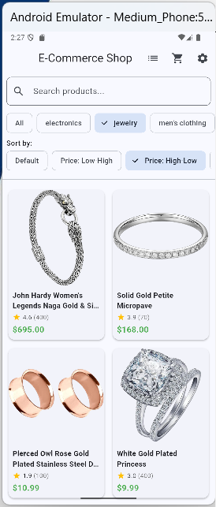
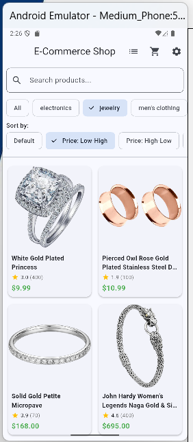

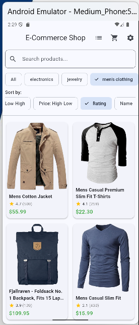
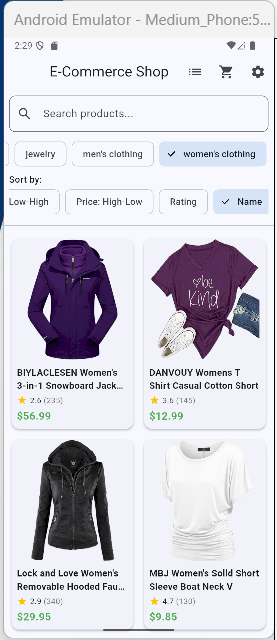

*Products filtered by category with multiple sorting options*

</div>

### Product Details

<div align="center">

**Product Detail Screen**

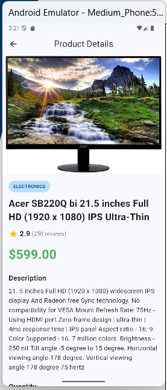

*Detailed product information with add to cart functionality*

</div>

### Shopping Cart

<div align="center">

**Cart with Items**

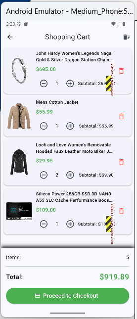

*Shopping cart showing items, quantities, and total*

**Empty Cart State**

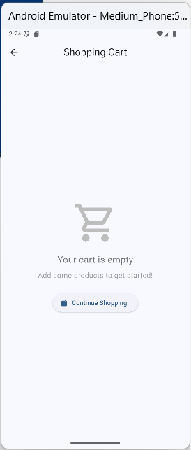

*Empty cart state with helpful message*

</div>

### Settings

<div align="center">

**Light Mode**

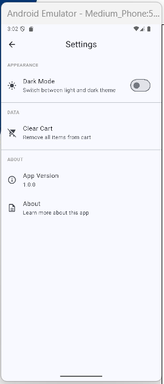

*Settings screen in light theme*

**Dark Mode**

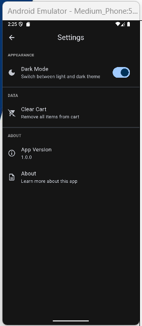

*Settings screen in dark theme showing theme toggle*

</div>

### Additional Features

<div align="center">

**Error State**

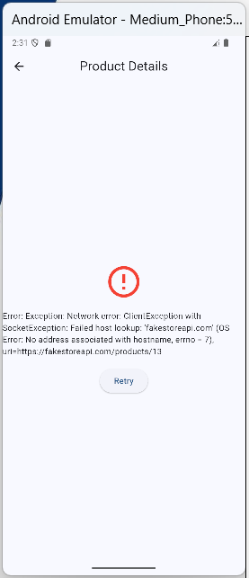

*Error message with retry button for failed operations*

</div>

---

## Implementation Checklist

### UI Components
- [x] Home screen with product grid
- [x] Alternative list view
- [x] Product detail screen
- [x] Shopping cart screen
- [x] Settings screen
- [x] Real-time search bar
- [x] Category filter chips
- [x] Sort option chips
- [x] Pull-to-refresh functionality
- [x] Smooth navigation between screens
- [x] App bar with contextual actions
- [x] Bottom sheet for options

### Product Features
- [x] Product image display
- [x] Product title and price
- [x] Product description
- [x] Product category
- [x] Product rating and reviews
- [x] Grid and list layouts
- [x] Responsive design

### Search and Filter Capabilities
- [x] Search by product title
- [x] Search by product description
- [x] Real-time filtering (as you type)
- [x] Category filtering
- [x] Sort by price (ascending/descending)
- [x] Sort by rating
- [x] Sort alphabetically (A-Z)
- [x] Combined search, filter, and sort
- [x] Clear search functionality
- [x] Dynamic category list
- [x] Client-side filtering (no redundant API calls)

### Shopping Cart Features
- [x] Add items to cart
- [x] Quantity selection
- [x] Display cart items
- [x] Update quantities (+/-)
- [x] Remove individual items
- [x] Clear entire cart
- [x] Item subtotal calculation
- [x] Total price calculation
- [x] Item count display
- [x] Cart badge on icon
- [x] Cart persistence
- [x] Empty cart state

---

## Challenges and Learnings

### Challenges

During development, three main challenges were encountered. First, SnackBar notifications weren't displaying when users added items to their cart due to incorrect BuildContext usage in nested widgets, which was resolved by wrapping actions with a Builder widget. Second, after fixing the initial issue, SnackBars wouldn't dismiss and kept stacking on screen, requiring implementation of clearSnackBars() before showing new notifications. Third, the "All" category filter had two problems: it wouldn't highlight when selected and continued filtering products instead of showing all items. This was caused by selection logic only checking for null values and using OR operators instead of AND in the filter condition, which was fixed by updating the logic to check for both null and 'All' values and correcting the logical operators.

### Learnings

Using Cubit for state management made the development process much smoother. It provided a clean way to separate business logic from UI components, making the code more organized and easier to maintain. The clear state transitions helped implement proper loading and error handling throughout the app. Cubit's simplicity was particularly helpful for managing cart persistence, theme switching, and view mode toggling while keeping the codebase straightforward and testable.
